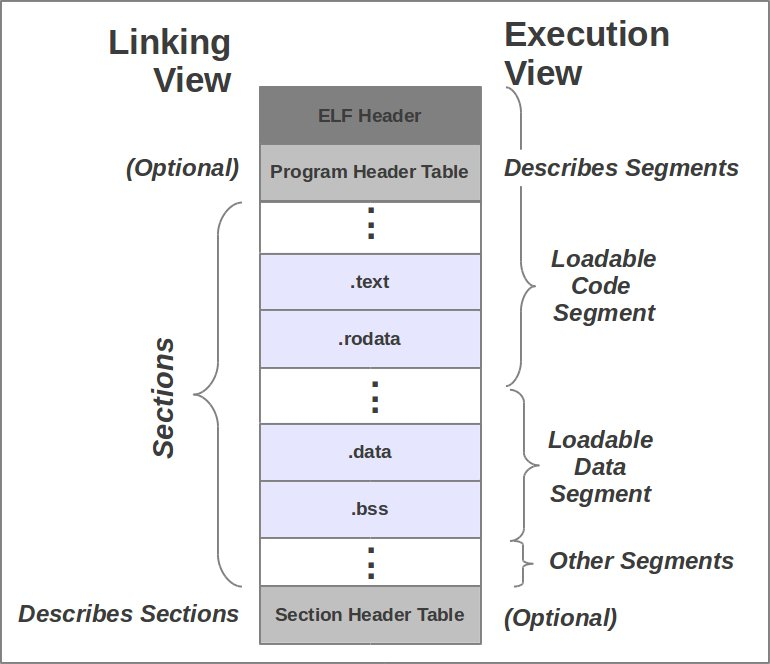

# ft\_nm

`ft_nm` is a reimplementation of the Unix `nm` command. It parses ELF (Executable and Linkable Format) object files and displays the symbols they contain.

This README offers an in-depth walkthrough of how ELF files work, from structure to runtime loading, to help you understand how `nm` (and your own `ft_nm`) operates under the hood.

---

## Table of Contents

- [What is an ELF file?](#what-is-an-elf-file)
- [Structure of an ELF file](#structure-of-an-elf-file)
- [Visualizing the ELF Structure](#visualizing-the-elf-structure)
- [ELF Header Structure](#elf-header-structure)
  - [ELF Header Fields](#elf-header-fields)
- [Symbol Table Entry Structure](#symbol-table-entry-structure)
  - [Symbol Table Fields](#symbol-table-fields)
- [Segments vs Sections](#segments-vs-sections)
- [Compilation to Execution](#compilation-to-execution)
- [What is a Linker, Loader, and Dynamic Linker?](#what-is-a-linker-loader-and-dynamic-linker)
- [What is a Symbol?](#what-is-a-symbol)
- [What does `nm` do?](#what-does-nm-do)
- [How does `ft_nm` work?](#how-does-ft_nm-work)
- [ELF Symbol Parsing in `ft_nm`](#elf-symbol-parsing-in-ft_nm)
- [Tools](#tools)
- [Build and Usage](#build-and-usage)
- [Test Suite](#test-suite)

---

## What is an ELF file?

**ELF** (Executable and Linkable Format) is a standard binary format used on Unix-based systems such as Linux. It can represent:

- **Executables** (`a.out`, `/bin/ls`, etc.)
- **Object files** (`main.o`, `lib.o`, etc.)
- **Shared libraries** (`libc.so`, etc.)
- **Core dumps** (generated on crash)

It supports static and dynamic linking, and is flexible enough for use on desktops, servers, embedded systems, and even game consoles.

To check if a binary is in ELF format:

```bash
file /bin/bash
/bin/bash: ELF 64-bit LSB pie executable, x86-64, version 1 (SYSV), dynamically linked, interpreter /lib64/ld-linux-x86-64.so.2, BuildID[sha1]=..., for GNU/Linux 3.2.0, stripped
```

---

## Structure of an ELF file


An ELF file is composed of:

- An **ELF Header**: entry point of the file, containing offsets to the rest.
- A **Program Header Table**: describes segments to be loaded in memory (used by the loader at runtime).
- A **Section Header Table**: describes logical sections (used by the linker at link-time).
- The actual **sections**: `.text`, `.data`, `.rodata`, `.symtab`, etc.

---

### Notes

- An ELF file can have **zero or many sections**. For example, stripped binaries may lack the Section Header Table entirely.
- Similarly, `.symtab` and `.strtab` are often absent from release binaries.
- The Program Header Table is critical for execution, while the Section Header Table is primarily useful for linking and debugging.

---

## Visualizing the ELF Structure

You can explore each part of an ELF file using real commands:

### ELF Header

```bash
readelf -h ./your_binary
```

This prints general ELF information including:
- Entry point address
- Offset to the program headers (`e_phoff`)
- Offset to the section headers (`e_shoff`)

---

### Program Header Table (Segments)

```bash
readelf -l ./your_binary
```

Shows how the binary will be mapped into memory:
- Segment types (`LOAD`, `INTERP`, etc.)
- File offsets and virtual addresses
- Runtime memory permissions (R/W/X)

> "Mapped into memory" means that the operating system will load a part of the ELF file into RAM at a specific virtual address. 
> For example, code in the `.text` section will be loaded into memory and marked as executable, so the CPU can run it.
---

### Section Header Table (Sections)

```bash
readelf -S ./your_binary
```

Displays all sections and their metadata:
- Names (`.text`, `.data`, etc.)
- Offsets and sizes
- Memory addresses and section types

---

### Symbol Table and String Table

```bash
readelf -s ./your_binary
```

Lists symbols found in `.symtab` or `.dynsym`, along with their type, binding, and section index.

To inspect the actual string table content:

```bash
readelf -x .strtab ./your_binary
```

This dumps the raw bytes that `.symtab` uses to resolve symbol names.

---

## ELF Header Structure

```c
typedef struct {
  unsigned char e_ident[16]; // Magic number and other info
  uint16_t      e_type;      // Object file type
  uint16_t      e_machine;   // Architecture
  uint32_t      e_version;   // Object file version
  ElfN_Addr     e_entry;     // Entry point virtual address
  ElfN_Off      e_phoff;     // Program header table file offset
  ElfN_Off      e_shoff;     // Section header table file offset
  uint32_t      e_flags;     // Processor-specific flags
  uint16_t      e_ehsize;    // ELF header size in bytes
  uint16_t      e_phentsize; // Program header table entry size
  uint16_t      e_phnum;     // Program header table entry count
  uint16_t      e_shentsize; // Section header table entry size
  uint16_t      e_shnum;     // Section header table entry count
  uint16_t      e_shstrndx;  // Section header string table index
} ElfN_Ehdr;
```

### ELF Header Fields

- `e_ident`: Magic number, architecture class, and endianness.
- `e_type`: File type (e.g., REL for relocatable, EXEC for executable, DYN for shared object).
- `e_machine`: Target machine architecture.
- `e_version`: ELF specification version.
- `e_entry`: Entry point virtual address.
- `e_phoff`: Offset to the program header table.
- `e_shoff`: Offset to the section header table.
- `e_flags`: Processor-specific flags.
- `e_ehsize`: ELF header size in bytes.
- `e_phentsize`: Size of one program header table entry.
- `e_phnum`: Number of entries in the program header table.
- `e_shentsize`: Size of one section header table entry.
- `e_shnum`: Number of entries in the section header table.
- `e_shstrndx`: Index of the section header string table.

---

## Symbol Table Entry Structure

```c
typedef struct {
  uint32_t st_name;      // Symbol name (index into string table)
  ElfN_Addr st_value;    // Symbol value (address or offset)
  uint32_t st_size;      // Size of the symbol
  unsigned char st_info; // Type and Binding attributes
  unsigned char st_other;// Reserved (visibility)
  uint16_t st_shndx;     // Section index
} ElfN_Sym;
```

### Symbol Table Fields

- `st_name`: Index into `.strtab` where the symbol's name is stored.
- `st_value`: Address or offset associated with the symbol.
- `st_size`: Size in bytes of the symbol.
- `st_info`: Type (function, object) and binding (local, global).
- `st_other`: Usually 0, reserved for visibility.
- `st_shndx`: Section index that the symbol is defined in.

---

## Segments vs Sections

In ELF files, **segments** and **sections** are two different ways of organizing content — and they serve completely different purposes.

|              | **Segments**               | **Sections**              |
|--------------|----------------------------|---------------------------|
| **Used by**  | OS (at runtime)            | Linker, debugger          |
| **Found in** | Executables, shared objects| Object files, binaries    |
| **Defined in** | Program header table     | Section header table      |
| **Contain**  | Memory-mappable data       | Code, symbols, strings    |

### What's the difference?

- **Sections** are a *link-time* concept.  
  They describe the logical parts of the program, such as:
  - `.text` (code)
  - `.data` (initialized variables)
  - `.bss` (uninitialized data)
  - `.symtab`, `.strtab`, etc.

  The **linker** uses sections to combine object files into an executable or library.

- **Segments** are a *runtime* concept.  
  They define **how the binary should be loaded into memory**. Each segment (like `LOAD`, `INTERP`, `DYNAMIC`) tells the OS where and how to map parts of the file into virtual memory.

  The **loader** (in the OS) reads the **program headers** to map segments into memory with the correct permissions (read, write, exec).

> Multiple sections can be grouped into one segment.  
> For example: `.text`, `.rodata`, and `.plt` may all be loaded into a single `LOAD` segment marked read + exec.

### Visual Summary

Below is a visual representation of the relationship between segments and sections.  
This diagram highlights how segments cover parts of the file that are relevant to runtime execution, while sections are fine-grained metadata used during linking.



---

## Compilation to Execution

### Compilation Pipeline:

```bash
# Step 1: Compilation
$ gcc -c main.c       # Produces main.o (object file)

# Step 2: Linking
$ gcc main.o -o app   # Produces executable ELF file
```

### Runtime Pipeline:

- **Loader** reads the ELF header, maps segments into memory
- **Dynamic Linker** (`ld-linux.so`) loads required `.so` files and resolves dynamic symbols
- Execution starts at the **entry point** from the ELF header

---

## What is a Linker, Loader, and Dynamic Linker?

- **Linker**: Combines multiple object files into a single executable or library. It resolves symbols and creates `.symtab`, `.strtab`, and relocations.
- **Loader**: The OS component that loads the executable into memory. It reads the ELF header and program headers to know how to map segments (e.g., `.text`, `.data`).
- **Dynamic Linker**: Loads shared libraries needed by an executable at runtime (via `PT_INTERP`). Resolves unresolved dynamic symbols (`U` type).

---

## What is a Symbol?

A **symbol** is a named entity in the program: variable, function, label, etc. Each symbol has:

- A name (from the string table)
- A value (address or offset)
- A type (function, object)
- A binding (local, global, weak)
- A section index

There are two main symbol tables:

- `.symtab`: full list of symbols (static + local)
- `.dynsym`: only exported symbols (used by the dynamic linker)

Example using `readelf -s`:

```
Symbol table '.dynsym' contains 13 entries:
   Num:    Value          Size Type    Bind   Vis      Ndx Name
     1: 0000000000000000     0 FUNC    GLOBAL DEFAULT  UND free@GLIBC_2.2.5

Symbol table '.symtab' contains 119 entries:
   Num:    Value          Size Type    Bind   Vis      Ndx Name
    12: 0000000000401256   251 FUNC    LOCAL  DEFAULT   15 load_elf_file
    97: 0000000000401351   212 FUNC    GLOBAL DEFAULT   15 main
```

---

## What does `nm` do?

The `nm` command displays the contents of the ELF symbol table, helping you understand the layout of functions and variables:

```bash
$ nm hello.o
00000000 T main
         U printf
```

- `T` = symbol in `.text` (code)
- `U` = undefined (externally resolved)
- `D`, `B`, `W`, `L`, etc. = other section-based types

`nm` is invaluable for debugging linkage issues, reverse engineering, and understanding binary internals.

For more, read:
```bash
man nm
```

---

## How does `ft_nm` work?

1. Load the ELF file with `mmap`
2. Check magic number and class (32/64-bit)
3. Use section headers to find `.symtab` / `.strtab`
4. Parse the symbols
5. Sort them alphabetically
6. Display symbols with the same format as `nm`

```bash
$ ./ft_nm tests/obj/test_simple.o
00000000 T main
         U puts
```

---

## ELF Symbol Parsing in `ft_nm`

For each entry in `.symtab`:

- Read its name using offset into `.strtab`
- Determine type based on `st_info`, `st_shndx`, and section flags
- Build a structure with `name`, `type`, and `value`
- Filter internal or unneeded entries
- Print sorted result

---

## Tools

- `readelf -h`: Display ELF header
- `readelf -S`: Display section headers
- `readelf -s`: Display symbols in `.symtab` and `.dynsym`
- `readelf -l`: Display program headers (segments)
- `readelf -a`: Display all ELF info (header, program headers, sections, symbols, etc.)
- `nm`: Display symbols from object files
- `objdump -h`: Show section headers
- `xxd`: Hex dump binary for raw analysis

---

## Build and Usage

### Compile:

```bash
make
```

### Use:

```bash
./ft_nm your_binary.o
```

---

## Test Suite

Located in `tests/`, it covers notably:

- Empty files
- Static and dynamic symbols
- Undefined symbols
- Duplicates and sorting edge cases
- Invalid/non-ELF files

To run:

```bash
make test
```

